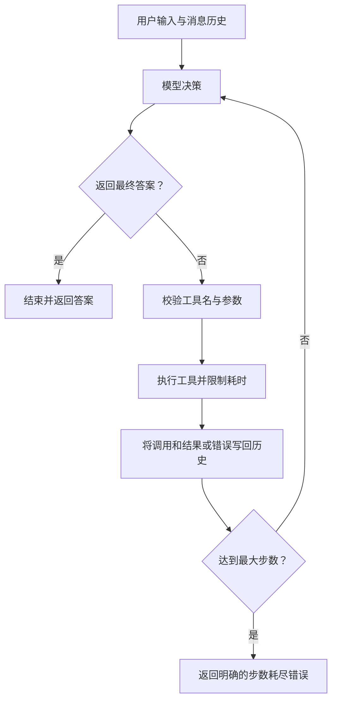

# 第1周：Python 异步与最小 Agent Loop

本周目标：理解异步任务的执行方式，使用 Pydantic v2 校验数据，用 FastAPI 提供接口，并独立手写一个不使用 Agent 框架的最小 Agent Loop。

学习时间：工作日每天3小时，周末每天3小时，合计21小时。每天建议1小时阅读或视频、2小时编码和调试；工作日有第4小时空余时，用于补缺，不新增必修内容。

## 学习资料

按“asyncio → Pydantic v2 → FastAPI → Agent Loop”顺序学习。视频辅助理解，API 用法以官方文档为准；无需看完所有课程或读完整个仓库。

### 1. Python asyncio（必修）

- [官方总览](https://docs.python.org/3/library/asyncio.html)：了解 asyncio 适用的 I/O 并发场景。
- [协程与任务](https://docs.python.org/3/library/asyncio-task.html)：重点阅读 Coroutines、Creating Tasks、Task Cancellation、Task Groups、Running Tasks Concurrently 和 Timeouts。
- [超时处理](https://docs.python.org/3/library/asyncio-task.html#timeouts)：练习 `asyncio.timeout()` 和 `wait_for()`。
- [官方示例源码（GitHub）](https://github.com/python/cpython/blob/main/Doc/library/asyncio-task.rst)：对照串行和并发示例，先自己写，再检查差异。

掌握：`async def`、`await`、`asyncio.run()`、`create_task()`、`gather()`、`TaskGroup`、取消与超时。`TaskGroup` 和 `asyncio.timeout()` 要求 Python 3.11+；本周不要求阅读底层事件循环源码。

### 2. Pydantic v2（必修）

- [官方入门](https://docs.pydantic.dev/latest/)。
- [Models](https://docs.pydantic.dev/latest/concepts/models/)：`BaseModel`、`model_validate()`、`model_dump()`。
- [Fields](https://docs.pydantic.dev/latest/concepts/fields/)：必填字段、默认值和长度约束。
- [Validators](https://docs.pydantic.dev/latest/concepts/validators/)：字段验证器与模型验证器。
- [JSON Schema](https://docs.pydantic.dev/latest/concepts/json_schema/)：使用 `model_json_schema()`，为第2周工具定义做准备。
- [视频：Pydantic (V2) — In-depth Starter Guide](https://www.youtube.com/watch?v=ok8bF8M7gjk)，MathByte Academy。优先看 Basic Models、Validation Exceptions、Required vs Optional Fields、Serialization 和 Custom Validators；其余可选。

练习定义 `ToolCall`、`ToolResult`，验证缺失字段、错误类型、空工具名，并导出 JSON Schema。注意区分“允许为 None”和“可以不传”。

### 3. FastAPI（必修）

- [官方教程](https://fastapi.tiangolo.com/tutorial/)：作为查阅入口。
- [First Steps](https://fastapi.tiangolo.com/tutorial/first-steps/)：启动服务并访问 `/docs`。
- [Request Body](https://fastapi.tiangolo.com/tutorial/body/)：使用 Pydantic 定义请求体。
- [Concurrency and async / await](https://fastapi.tiangolo.com/async/)：理解同步路由、异步路由与阻塞调用。
- [Handling Errors](https://fastapi.tiangolo.com/tutorial/handling-errors/) 和 [Testing](https://fastapi.tiangolo.com/tutorial/testing/)：处理错误并测试接口。
- [视频：FastAPI Part 7 — Sync vs Async](https://www.youtube.com/watch?v=2JPDt-Jp6fM)，Corey Schafer。选看同步/异步概念和路由部分，数据库迁移部分本周可跳过。
- [Corey Schafer 视频频道](https://www.youtube.com/@coreyms)：可在频道内搜索 AsyncIO 教程；这是频道入口，不是某一节视频直链。

本周只实现 `/health`、`/chat` 和基础接口测试。暂不学习认证、数据库、部署和流式输出。

### 4. Agent Loop 开源参考（完成初稿后选读）

- [sergenes/mini_agent](https://github.com/sergenes/mini_agent)：观察模型决策、工具执行、结果回填和继续循环的连接方式。
- [minimal-agent-harness](https://github.com/RohanKolappa/minimal-agent-harness)：只阅读基础循环、工具分派和消息历史；子 Agent、权限系统等扩展留到后续周次。

阅读时回答：模型什么时候结束？工具结果如何回到上下文？模型不断调用工具时如何停止？这两个仓库是参考材料，不要求安装或运行其中全部功能。

## 每日学习路线

以下 Day 1–7 可从实际开学日顺延，不依赖固定日历日期。

| 日期 | 阅读/视频（1小时） | 编码与调试（2小时） | 当天成果 |
|---|---|---|---|
| Day 1 | asyncio 总览、协程和 await | 写3个模拟 I/O 函数，对比顺序 await 与并发执行耗时 | `day1_async_basics.py`，记录耗时并解释差异 |
| Day 2 | create_task、gather、TaskGroup、取消 | 同时运行3个任务，取消其中一个，用 finally 记录清理动作 | `day2_tasks.py`，说明取消对其他任务的影响 |
| Day 3 | timeout、wait_for、异常传播 | 模拟正常返回、超时、工具异常；验证任务取消后会清理资源 | `day3_timeout.py` 和相关测试 |
| Day 4 | Pydantic Models、Fields、验证和 Schema | 定义 ToolCall/ToolResult，测试非法输入，导出 JSON Schema | `day4_schema.py` 和参数验证样例 |
| Day 5 | FastAPI First Steps、请求体、异步和测试 | 实现 GET /health 和 POST /chat，通过 /docs 调用，测试非法请求 | `day5_api.py` 和接口测试 |
| Day 6 | 回顾消息历史与工具调用过程 | 独立写最小 Agent Loop，再对照参考实现；把模型请求也纳入超时处理 | `min_agent_loop.py`，正常与失败执行记录 |
| Day 7 | 复盘知识点与代码（1小时） | 测试和整理交付（1小时），成果检查与口头讲解（1小时） | README 学习记录、流程图、测试结果、3分钟讲解 |

Day 1 可用两个各等待1秒的模拟任务实验：顺序执行约2秒，并发约1秒；不要把精确耗时写成易受机器负载影响的测试断言。

## 最小 Agent Loop 实作要求

核心循环及必要辅助逻辑控制在50–150行，测试与 FastAPI 包装独立存放，不通过压缩格式凑行数。不使用 LangGraph、LangChain 等 Agent 框架；允许使用模型 SDK、Pydantic 和 asyncio。



必须实现：

- 工具注册表：第一周一个无副作用工具即可，例如加法；五类工具留到第2周。
- 保留模型决策、工具调用及结果，下一轮能够读取前一轮结果。
- 校验模型输出，明确区分最终答案与工具调用。
- 限制模型请求和工具执行耗时，处理错误与最大步数耗尽。
- 使用类型注解，确保调用方取消任务时能停止并清理。
- 先用可控的假模型验证异常路径；周末用真实模型跑通至少一个“调用工具 → 读取结果 → 回答”的案例。未配置模型时标注“真实模型联调待完成”，不能以固定答案代替通过验收。

## 练习位置与现有参考

建议将自己的练习放在本目录的 `exercises/` 下，沿用表格中的文件名；练习测试放在 `tests/` 下。此处是建议目录，尚不代表已完成作业。

- [Agent Loop 参考](../src/agent_learning/core.py)
- [工具与参数模型参考](../src/agent_learning/tools.py)
- [FastAPI 参考](../src/agent_learning/api.py)
- [现有基础测试](../tests/test_core.py)

先自己写初稿，再对照参考。现有代码是教学骨架：默认 DemoModel 和天气等数据为模拟内容，现有测试通过不等于个人完成本周学习目标，也不代表所有错误场景已经覆盖。

从仓库根目录安装和运行现有测试：

```bash
python -m pip install -e ".[dev]"
python -m pytest -q
python -m agent_learning.demo
```

自己的接口文件完成后，从仓库根目录启动：

```bash
python -m uvicorn week01_min_loop.exercises.day5_api:app --reload
```

浏览器打开 `http://127.0.0.1:8000/docs`。

## 周末成果检查

只进行每周一次周检查：**周日20:00，Asia/Shanghai**。没有每日提醒；每日记录用于周末复盘。检查依据是你的代码、测试和解释，不按视频观看数量判断完成度。

### 提交清单

- [ ] Day 1–5 练习与运行记录。
- [ ] 独立完成的50–150行 Agent Loop。
- [ ] FastAPI 调用演示与一次真实模型工具调用记录，隐藏 API Key。
- [ ] 3–5个核心单元测试，必要时用参数化覆盖多个错误场景；另附接口测试。
- [ ] 一张流程图和 README 学习总结。
- [ ] 3分钟讲解：输入如何进入循环、何时调用工具、如何终止、失败如何处理。

### 测试场景

| 场景 | 预期表现 |
|---|---|
| 正常工具调用 | 模型读取工具结果，再生成最终答案 |
| 参数错误、未知工具或非法模型输出 | 得到明确错误，不执行错误工具 |
| 模型或工具超时 | 有界终止或反馈错误，不无限等待 |
| 工具抛出异常 | 产生可解释的错误，任务状态可追踪 |
| 模型持续要求调用工具 | 达到最大步数后停止 |
| FastAPI 合法/非法请求 | 正常请求返回结构化结果；非法请求被校验拒绝 |

### 口头验收问题

1. coroutine、Task、Future 分别是什么？
2. 为什么连续写两个 await 通常不会让它们并发？
3. `time.sleep()` 放进 async 函数会发生什么？
4. 超时与取消有什么关系？清理逻辑放在哪里？
5. Pydantic 的可空字段和可省略字段有何区别？
6. Agent Loop 与预先写死的函数调用顺序有什么区别？
7. 哪些代码是你独立完成的，哪些参考了已有实现？能否现场修改一个终止条件？

反馈分为“通过 / 需补交 / 未完成”，列出有证据的完成项、问题位置、修复建议和下周调整。若尚未提交成果，状态记为“待检查”，不推断学习进度。

### 周报模板

```text
本周日期：
实际学习时长：
完成的主题：
代码路径或提交记录：
测试命令与结果：
真实模型运行情况：
独立完成与参考代码的范围：
最重要的一个理解：
尚未解决的问题：
下周需要补做的内容：
```
