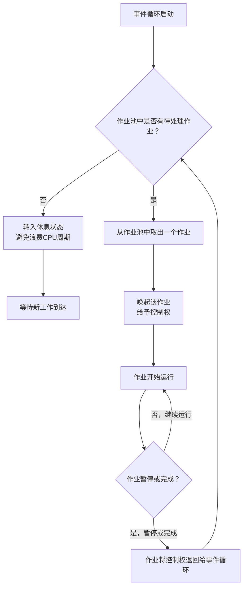

## 今日阅读文档

asyncio 总览、协程和 await

## 今日目标

写3个模拟 I/O 函数，对比顺序 await 与并发执行耗时

## 今日成果

`day1_async_basics.py`，记录耗时并解释差异

## asyncio --- 异步 I/O

### asyncio 总览

asyncio 是用来编写`并发`代码的库，使用`async/await`语法。

asyncio 被用作多个`Python`异步框架的基础，这些框架提供高性能网络和网站服务，数据库连接库，分布式任务队列等等。

asyncio 往往是构建`IO`密集型和高层级`结构化`网络代码的最佳选择。

asyncio主要构成部分：事件循环（event loop）、协程函数（coroutine functions）、协程对象（coroutine objects）、任务（tasks）和await

#### 事件循环

asyncio主要以事件循环有关。事件循环包含一组等待运行的作业，有些作业是你直接添加的，有些则是由asyncio间接添加的。事件循环会从其待处理事项中取出一个作业并唤起它（给予控制权），类似于调用一个函数，然后该作业就会运行。一旦它暂停或完成，它会将控制权返回给事件循环。然后事件循环会从作业池中选择另一个作业并唤起它。可以暂且将这组作业视为一个队列：作业被添加然后被逐个处理，通常（但不总是）按顺序进行。此过程将无限地重复，事件循环也不停地循环下去。如果没有待执行的作业，事件循环会足够智能地转入休息状态以避免浪费CPU周期，并在有更多工作需完成时恢复运行。



> 这里有一个注意的点，控制权是作业主动交还的，而不是事件循环强制收回去的。

> 每个作业运行时，都占有控制权，它必须自觉地在合适的时候暂停（比如等待I/O），把控制权交回去。这是一种基于`信任和合作`地协作式（cooperative）调度。这个调度方式就会面临一个问题，假如某个作业拿到控制权后，一直不暂停不完成，比如：死循环、超长的纯计算任务、永远在忙，从不等待I/O，这样就会导致这个作业不会把控制权还回去，事件循环就卡住了，而作业池中还有其他作业在排队等待着执行，这些等待的作业永远等不到运行的机会。事件循环存在的意义就是并发地处理推进多个作业，一旦一个作业能无限制霸占控制权，拿它和“只运行一个程序，其他全卡死”没有区别，事件循环地调度机制就会退化成单任务阻塞，而导致事件循环机制变得毫无用处。

```python
# 最小的事件循环

import asyncio

async def task1():
    print('hello')
    await asyncio.sleep(1)  # 暂停 1 秒，把控制权交还给事件循环
    print('world')

async def task2():
    print('foo')
    await asyncio.sleep(2)
    print('bar')

async def main():
    # 并发运行两个任务，等它们都完成
    await asyncio.gather(
        task1(),
        task2(),
    )

asyncio.run(main())
```

```text
输出：
hello
foo
（等 1 秒）
world
（再等 1 秒）
bar
```

#### 异步函数和协程

就拿上面那个最小的事件循环来说明异步函数和协程。

一个普通的函数通常为

```python
def task1():
    print('hello')
    print('world')
```

调用一个普通的函数会执行他的逻辑或函数体

```pycon
>>> task1()
hell
wrold
```

与普通的`def`不同，`async def`使它成为一个异步函数（或“协程函数”）。调用它会创建并返回一个`协程`对象。

```python
async def task1():
    print('hello')
    await asyncio.sleep(1)
    print('world')
```

调用异步函数`task1`不会执行打印语句；相反，它会创建一个协程对象:

```pycon
>>> task1()
<coroutine object loudmouth_penguin at 0x...>
```

协程本质上就是一个函数/一段代码逻辑，只不过它被特殊标记（async关键字），使得它具备“可暂停/可恢复”的能力。

协程必须显式启动，调用一个协程函数不会执行里面的代码，它只是返回一个协程对象。（类似于生成器函数）我们必须把它交给事件循环去“驱动”它

协程可以在函数体的不同位置暂停和恢复，这是协程和普通函数最本质的区别。

- 普通函数：一旦调用，从头跑到尾，中间不能停，直到 return。
- 协程：遇到 await 时，可以把当前执行状态（局部变量、执行到哪一行）保存下来，让出控制权，等条件满足后再从暂停的地方继续。暂停期间，事件循环可以去执行别的协程，这就是“并发”的来源。因为能暂停，程序在等待 I/O（网络请求、文件读写、数据库查询）时，不会傻等，而是切去干别的事：

总结为：协程是一个可以中途暂停、稍后从原地继续的函数；但你必须主动“启动”它，它才会跑。正是这种“能停能续”的特性，让程序在等待时可以去处理其他任务，从而实现异步。

#### 任务

任务（tasks）包装的是“协程对象”，不是“协程函数”。协程对象是“可暂停的执行体”，但它孤立存在、不会自己跑；tasks = 把协程对象挂到事件循环上，让事件循环自动调度它。所以 tasks 绑定的是协程对象（foo()），而不是协程函数（foo）。

```python
async def foo():        # ①协程函数（coroutine function）
    print("hi")

c = foo()               # ② 协程对象（coroutine object）
                        #   注意：此时 print 还没执行

task = asyncio.create_task(foo())   # ③ 任务（Task）
#                        ↑ 传进去的是 foo()，即协程对象
```

推荐使用`asyncio.create_task()`创建任务。创建任务会自动安排它的执行（通过在事件循环的待办事项列表（即作业集合）中添加回调函数来运行它）。

推荐（且常见）的做法是使用`asyncio.run()`，它负责管理事件循环并确保提供的协程在继续执行之前结束。例如，许多异步程序都遵循以下设置:

```python
import asyncio

async def main():
    # 执行各种稀奇古怪、天马行空的异步操作……
    ...

if __name__ == "__main__":
    asyncio.run(main())
    # 直到协程 main() 结束，程序才会到达下面的打印语句。
    print("coroutine main() is done!")
```

需要注意的是，任务本身不会被添加到事件循环中，只有任务的回调函数才会被添加到事件循环中。如果你创建的任务对象在被事件循环调用之前就被垃圾回收了，这就会产生问题。例如，考虑这个程序：

```python
async def hello():
    print("hello!")

async def main():
    asyncio.create_task(hello())
    # 其他异步指令运行一段时间并将控制权交还给事件循环......
    ...

asyncio.run(main())
```
由于没有对第5行创建的任务对象的引用，它可能在事件循环调用它之前就被垃圾回收了。协程main()中的后续指令将控制权交还给事件循环，以便它可以调用其他作业。当事件循环最终尝试运行该任务时，它可能会失败并发现任务对象不存在！即使协程持有对某个任务的引用，但如果协程在该任务结束之前就完成了，也可能发生这种情况。当协程退出时，局部变量超出范围，可能被垃圾回收。

#### await

`await`是一个 Python 关键字，通常以两种不同的方式使用:

```python
await task
await coroutine
```

从关键方面来说，`await`的行为取决于所等待对象的类型。

等待任务会将控制权从当前任务或协程交还给事件循环。在交还控制权的过程中，会发生一些重要的事情。我们将使用以下代码示例来说明:

```python
async def plant_a_tree():
    dig_the_hole_task = asyncio.create_task(dig_the_hole())
    await dig_the_hole_task

    # 与植树相关的其他指令。
    ...
```

在这个例子中，假设事件循环已经将控制权交给了协程`plant_a_tree()` 的开始部分。如上所示，协程创建了一个任务，然后对其执行了`await`。`await dig_the_hole_task`这条指令会将一个回调函数（用于恢复`plant_a_tree()`的执行）添加到 `dig_the_hole_task` 对象的回调函数列表中。随后，这条指令将控制权交还给事件循环。过一段时间后，事件循环会将控制权传递给 `dig_the_hole_task`，该任务会完成它需要做的工作。一旦任务结束，它会将它的各种回调函数添加到事件循环中，在这里是恢复 `plant_a_tree()` 的执行。

一般来说，当等待的任务完成时 `(dig_the_hole_task)`，原先的任务或协程 `(plant_a_tree())` 将被添加回事件循环的待办列表以便恢复运行。

与任务不同，`await coroutine` 不会像 `create_task()` 那样创建独立任务；但如果该协程内部执行了真正的异步等待，例如 `await asyncio.sleep()`，控制权仍会通过内部等待交还给事件循环。 先将协程包装到任务中，然后再等待，会导致控制权交还。`await coroutine` 的行为实际上与调用常规的同步 `Python` 函数相同。考虑以下程序:
gii
```python
import asyncio

async def coro_a():
   print("I am coro_a(). Hi!")

async def coro_b():
   print("I am coro_b(). I sure hope no one hogs the event loop...")

async def main():
   task_b = asyncio.create_task(coro_b())
   num_repeats = 3
   for _ in range(num_repeats):
      await coro_a()
   await task_b

asyncio.run(main())
```

协程 `main()` 中的第一条语句创建了 `task_b` 并调度它通过事件循环运行。然后，将重复地等待 `coro_a()`。 控制权从未被交还给事件循环，这就是为什么在 `coro_b()` 的输出之前我们会看到所有三次唤起 coro_a() 的输出：

```text
I am coro_a(). Hi!
I am coro_a(). Hi!
I am coro_a(). Hi!
I am coro_b(). I sure hope no one hogs the event loop...
```

如果我们将 await coro_a() 改为 await asyncio.create_task(coro_a())，行为就会发生变化。协程 main() 会通过该语句将控制权交还给事件循环。然后，事件循环会继续处理其积压的工作，先调用 task_b，然后调用包装 coro_a() 的任务，最后恢复协程 main()。

```text
I am coro_b(). I sure hope no one hogs the event loop...
I am coro_a(). Hi!
I am coro_a(). Hi!
I am coro_a(). Hi!
```

这个例子强调了仅使用 await coroutine 可能会无意中霸占其他任务的控制权并在实际上阻滞事件循环。 asyncio.run() 可以通过 debug=True 旗标来检测这种情况，它将会启用 调试模式。此外，它还会记录任何独占执行时间 100 毫秒以上的协程。

该设计有意牺牲了 await 用法的某些概念明晰度以提升性能。每当有任务被等待时，控制权都需要沿着调用栈一路向上传递到事件循环。

#### 作业结论

顺序执行耗时约 4.5 秒，并发执行耗时约 2 秒，接近最长单个任务耗时 2 秒。顺序 await 仍然逐个等待，因此没有获得并发收益。